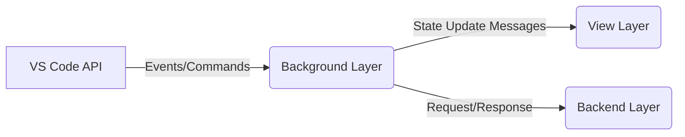
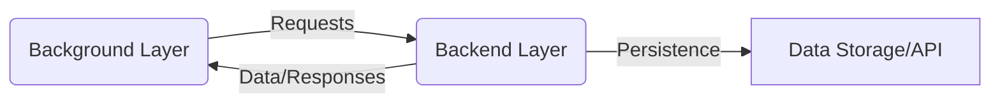
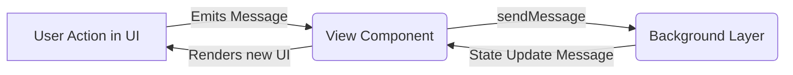

# Final Results: Project Architecture Documentation
This document consolidates the analysis of the project's architecture, divided into the three main layers as defined in the project's constitution.

---
## 1. Background Layer Architecture

### Analysis Summary
The Background layer acts as the primary orchestrator for each module, handling communication between the VS Code API, the View layer (webviews), and any optional Backend services. All analyzed modules correctly inherit from `Core.Background` and are registered in the main application, adhering to the architecture constitution.

### Communication Diagram (Conceptual):

---
## 2. Backend Layer Architecture

### Analysis Summary
The Backend layer is designed for business logic and data persistence, ensuring that it remains decoupled from the VS Code environment. Modules that require significant data processing or state management implement this layer. A key observation is that not all modules require a Backend; many function purely as orchestrators (Background) and UI providers (View).

### Communication Diagram (Conceptual):

---
## 3. View Layer Architecture

### Analysis Summary
The View layer is responsible for rendering the user interface within the VS Code webviews. All modules employing a UI are expected to use Lit for creating Web Components, adhering strictly to the `constitution.view`. This constitution emphasizes "dumb components" with no business logic, reactive updates, and a structured approach to templates and styles. Communication from the View to the Background layer is exclusively via the Event Bus (`sendMessage`).

### Communication Diagram (Conceptual):
