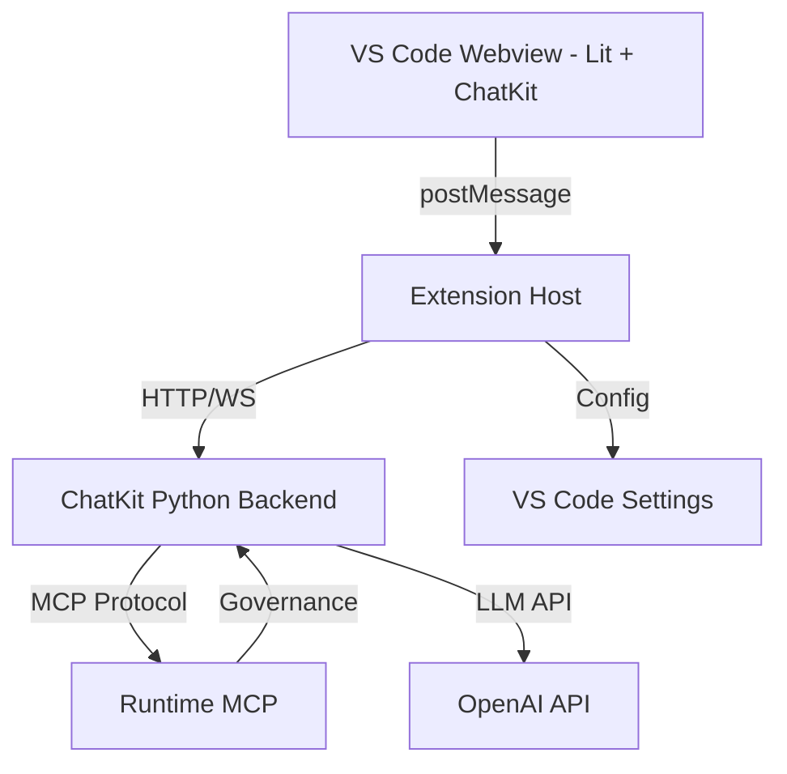

# Analysis — 2-implementacion-adr-vscode-integration

🏛️ **architect-agent**: Análisis arquitectónico completo para crear roadmap de implementación del ADR-001 con stack TypeScript

## 1. Resumen ejecutivo

**Problema**
El ADR-001 define una arquitectura compleja para integrar tres tecnologías principales (OpenAI ChatKit UI, OpenAI Agent SDK, Runtime MCP) en una extensión de VS Code. Para ejecutar esta implementación con control, trazabilidad y calidad, necesitamos descomponer la arquitectura en tareas atómicas organizadas en un roadmap estructurado.

**Objetivo**
Crear un roadmap completo de tareas/ADRs que:
- Descomponga el ADR-001 en componentes independientes pero integrados
- Establezca orden de ejecución lógico con dependencias claras
- Permita ejecución controlada y trazable de todo el proyecto
- Cubra todos los dominios: UI/ChatKit, Agent SDK, Runtime MCP, Setup/Config, Seguridad

**Criterio de éxito**
- Todos los AC definidos en `acceptance.md` están cubiertos por tareas específicas del roadmap
- Stack tecnológico TypeScript (Lit + ChatKit + Agents SDK) analizado y validado
- Agentes y responsabilidades definidos para cada dominio
- Documento de roadmap listo para ser creado en Phase 3

---

## 2. Estado del proyecto (As-Is)

### Estructura relevante

**Proyecto**: `agentic-workflow`
- TypeScript/Node.js MCP server
- VS Code extension (host + webview)
- Sistema mono-agent (`architect-agent` actual)
- Persistencia en `.agent/artifacts/`

**Módulos existentes** (inferido de ADR-001):
- `chat`: Módulo donde se integrará ChatKit UI
- `setup`: Configuración y settings  
- Extension Host: Lógica backend de la extensión
- Webview: UI actual (será reemplazada por ChatKit)

**Constituciones activas**:
- `clean-code.md`
- `agents-behavior.md`
- `runtime-integration.md`

### Componentes existentes

1. **VS Code Extension (actual)**:
   - Architecture: host-webview con `postMessage`
   - UI: sidebar con webview custom
   - Backend: Extension Host en Node.js
   - No hay integración actual con OpenAI ChatKit ni Agent SDK

2. **Runtime MCP**:
   - Servidor MCP TypeScript funcional
   - Tools: `runtime_*` para workflow management
   - Gobernanza de constituciones
   - **Limitaciones detectadas**: No tiene sistema de roles/permisos empresariales

3. **Sistema de artifacts**:
   - Path: `.agent/artifacts/{taskId}-{taskTitle}/`
   - No configurable actualmente
   - Necesita setup para paths customizables

### Limitaciones detectadas

**Técnicas**:
- Node.js 22+ requerido para Agents SDK (verificar compatibilidad con Extension Host)
- CSP estricto necesario para ChatKit en webview
- Session management de ChatKit requiere endpoint custom

**Estructurales**:
- Actualmente mono-agent (necesita multi-agent para workflows complejos)
- No hay sistema de roles/permisos
- Configuración de modelos LLM inexistente

---

## 3. Cobertura de Acceptance Criteria

### AC-1: Alcance - Roadmap de Tareas

**Interpretation**:
Crear un roadmap que transforme el ADR-001 en tareas específicas, atómicas, con dependencias explícitas y orden de ejecución lógico.

**Verification**:
- Documento `roadmap.md` existe
- Cada tarea tiene: título, objetivo, dependencias, componentes afectados
- Orden de ejecución respeta dependencias (ej: Setup antes de UI)

**Riesgos / ambigüedades**:
- Granularidad de tareas: demasiado atómicas = overhead, muy amplias = riesgo
- **Mitigación**: Agrupar por componente técnico (ChatKit, Agent SDK, MCP) y por capa (Setup, UI, Backend, Governance)

---

### AC-2: Entradas / Datos

**Interpretation**:
Usar ADR-001, diagramas arquitectónicos y constituciones como fuentes primarias para extraer tareas.

**Verification**:
- Cada tarea del roadmap referencia sección específica del ADR-001
- Constituciones integradas en tareas de seguridad/governance

**Riesgos / ambigüedades**:
- ADR-001 puede no ser exhaustivo en detalles de implementación
- **Mitigación**: Research de Phase 1 complementa con detalles técnicos específicos (Lit, ChatKit Web Component, Agents SDK docs)

---

### AC-3: Salidas / Resultado esperado

**Interpretation**:
Documento de roadmap estructurado con tareas numeradas, agrupadas por dominio, con metadatos completos.

**Verification**:
- Tabla o lista numerada con todas las tareas
- Cada tarea incluye: ID, título, objetivo, dependencias, componentes, dominio
- Mermaid diagram de dependencias (opcional pero recomendado)

**Riesgos / ambigüedades**:
- Formato del roadmap no especificado en AC
- **Mitigación**: Usar markdown con tabla estructurada + diagrama Mermaid

---

### AC-4: Restricciones

**Interpretation**:
El roadmap debe cubrir obligatoriamente estos 5 aspectos técnicos:
1. Integración de ChatKit en módulo chat
2. Dropdown de selección de modelos + config
3. Control total de Runtime MCP
4. Sistema de roles/permisos escalable
5. Path customizable de artifacts

**Verification**:
- Buscar en roadmap tareas específicas para cada restricción
- Cada restricción mapeada a 1+ tareas concretas

**Riesgos / ambigüedades**:
- "Control total" del Runtime MCP es ambiguo
- **Mitigación**: Definir en roadmap control granular: workflow state, task management, tool authorization, permission validation

---

### AC-5: Criterio de aceptación (Done)

**Interpretation**:
Roadmap aprobado por desarrollador antes de proceder a implementación.

**Verification**:
- `roadmap.md` existe
- Desarrollador emite `decision: SI` en aprobación
- Phase 3 completada en `task.md`

**Riesgos / ambigüedades**:
- Desarrollador puede requerir múltiples iteraciones
- **Mitigación**: Solicitar feedback específico en cada iteración

---

## 4. Research técnico

### Alternativa A: Stack TypeScript Completo (RECOMENDADO - CONFIRMADO POR DESARROLLADOR)

**Descripción**:
- **Frontend**: Lit (TypeScript) + OpenAI ChatKit Web Component
- **Backend**: OpenAI Agents SDK (`@openai/agents`) en Extension Host
- **Runtime**: Runtime MCP (TypeScript/Node.js)
- **Backend ChatKit**: Self-hosted con ChatKit Python SDK + Agent SDK integration

**Ventajas**:
- ✅ Stack unificado TypeScript end-to-end (excepto ChatKit backend)
- ✅ Lit es recomendación oficial de Microsoft para webviews
- ✅ Bundle mínimo (Lit ~5KB)
- ✅ ChatKit Web Component framework-agnostic (compatible con Lit)
- ✅ Agents SDK corre directamente en Extension Host (Node.js)
- ✅ Control total sobre backend = integración completa con Runtime MCP
- ✅ Alineado con confirmación del desarrollador ("El stack en typescript")

**Inconvenientes**:
- ⚠️ ChatKit Python SDK requiere backend Python (pero puede ser microservicio separado)
- ⚠️ Node.js 22+ requerido para Agents SDK (verificar VS Code compatibility)
- ⚠️ Self-hosted backend más complejo que managed (OpenAI Agent Builder)

---

### Alternativa B: Managed Backend (OpenAI Agent Builder)

**Descripción**:
- Frontend: Lit + ChatKit Web Component
- Backend: OpenAI Agent Builder (managed by OpenAI)
- Runtime MCP: Sin integración directa (solo observabilidad limitada)

**Ventajas**:
- ✅ Setup más rápido
- ✅ Infraestructura gestionada por OpenAI

**Inconvenientes**:
- ❌ Vendor lock-in total con OpenAI
- ❌ **NO permite integración con Runtime MCP** (sin control sobre tool execution)
- ❌ No cumple AC-4 (control total del Runtime MCP)

**Decisión**: **DESCARTADA** - No cumple requisito de control total de Runtime MCP

---

### Decisión recomendada

**Alternativa A: Stack TypeScript con Self-hosted Backend**

**Justificación**:
1. Cumple todos los AC (especialmente AC-4: control total de Runtime MCP)
2. Confirmado por desarrollador ("El stack en typescript")
3. Permite gobernanza completa vía Runtime MCP
4. Arquitectura escalable para sistema de roles/permisos empresariales

**Arquitectura final**:

```
┌─────────────────────────────────────┐
│ VS Code Webview (TypeScript)        │
│ ├─ Lit components                   │
│ └─ <openai-chatkit> web component   │
└─────────────────────────────────────┘
        ↕ postMessage (auth tokens, messages)
┌─────────────────────────────────────┐
│ Extension Host (TypeScript/Node.js) │
│ ├─ Chat module integration          │
│ ├─ Model dropdown management        │
│ ├─ Session endpoint (client secrets)│
│ └─ Communication bridge to backend  │
└─────────────────────────────────────┘
        ↕ HTTP/WebSocket
┌─────────────────────────────────────┐
│ ChatKit Backend (Python)            │
│ ├─ ChatKit Python SDK               │
│ ├─ OpenAI Agents SDK integration    │
│ └─ Runtime MCP middleware           │
└─────────────────────────────────────┘
        ↕ MCP Protocol
┌─────────────────────────────────────┐
│ Runtime MCP (TypeScript/Node.js)    │
│ ├─ Workflow state management        │
│ ├─ Tool authorization               │
│ ├─ Permission validation            │
│ └─ Role-based access control        │
└─────────────────────────────────────┘
```

---

## 5. Agentes participantes

### Agent 1: `ui-agent`
**Responsabilidades**:
- Integración de Lit components en webview
- Integración de ChatKit Web Component
- Theming y accesibilidad
- postMessage communication con Extension Host

**Subáreas asignadas**:
- `src/extension/webview/` (nuevo o modificado según estructura)
- Dropdown de selección de modelos LLM
- ChatKit initialization y configuration

---

### Agent 2: `backend-agent`
**Responsabilidades**:
- Extension Host logic
- ChatKit session management (client secrets endpoint)
- Comunicación con ChatKit backend
- Model configuration storage

**Subáreas asignadas**:
- `src/extension/chat/` (módulo chat)
- Session token refresh
- WebSocket/HTTP client para backend

---

### Agent 3: `agent-sdk-specialist`
**Responsabilidades**:
- Implementación de ChatKit Python backend
- Integración de OpenAI Agents SDK (`@openai/agents`) con Python backend
- Multi-agent workflows
- Tool integration

**Subáreas asignadas**:
- ChatKit Python SDK setup
- Agent definitions y handoffs
- Tool function implementations

---

### Agent 4: `mcp-governance-agent`
**Responsabilidades**:
- Runtime MCP middleware integration
- Sistema de roles y permisos
- Tool authorization policies
- Workflow state management

**Subáreas asignadas**:
- Runtime MCP client en backend Python
- Permission validation layer
- Role-based access control (RBAC) system
- Audit logs

---

### Agent 5: `setup-config-agent`
**Responsabilidades**:
- Configuración de modelos LLM
- Path customizable de artifacts
- Environment variables y secrets management
- Setup UI en módulo `setup`

**Subáreas asignadas**:
- `src/extension/setup/` (módulo setup)
- Configuration schema (Zod validation)
- Settings persistence (VS Code Memento API o SecretStorage)

---

### Agent 6: `security-agent`
**Responsabilidades**:
- CSP (Content Security Policy) para webview
- OAuth 2.0 / short-lived tokens
- Secrets management (API keys, client secrets)
- Input/output sanitization

**Subáreas asignadas**:
- CSP policies
- Authentication flow
- Guardrails para AI agents (validation)

---

### Agent 7: `release-agent`
**Responsabilidades**:
- Gestión de versiones y releases
- Publicación a NPM registry
- CI/CD pipeline (GitHub Actions)
- Changelog automation
- Documentation updates para releases

**Subáreas asignadas**:
- `.github/workflows/` (CI/CD pipelines)
- `package.json` versioning
- `CHANGELOG.md` generation
- Release notes automation
- NPM publishing scripts
- GitHub release creation

---

### Handoffs

**Workflow de desarrollo**:
```
1. setup-config-agent → Crea configuraciones base
   ↓
2. backend-agent → Implementa Extension Host logic
   ↓
3. ui-agent → Integra ChatKit en webview
   ↓
4. agent-sdk-specialist → Implementa backend Python con Agents SDK
   ↓
5. mcp-governance-agent → Integra Runtime MCP middleware
   ↓
6. security-agent → Audita y refuerza seguridad
   ↓
7. release-agent → Gestiona releases y deployment
```

---

### Componentes necesarios

**CREAR**:
- [ ] Módulo `chat/chatkit-integration.ts` (Extension Host)
- [ ] Lit components para dropdown de modelos
- [ ] ChatKit Python backend (microservicio separado)
- [ ] Runtime MCP middleware layer (Python)
- [ ] Sistema RBAC (roles y permisos)
- [ ] UI de configuración en módulo `setup`
- [ ] Client secrets endpoint (session management)
- [ ] **CI/CD pipelines** (`.github/workflows/`):
  - [ ] `ci.yml` → Automated tests on PR
  - [ ] `release.yml` → NPM publish on version tag
  - [ ] `release-please.yml` → Automated changelog + version bump
- [ ] **Release scripts**:
  - [ ] `scripts/prepare-release.sh` → Pre-release validation
  - [ ] `scripts/publish-npm.sh` → NPM publishing automation
- [ ] **Deployment docs**:
  - [ ] `docs/deployment.md` → Deployment guide
  - [ ] `docs/release-process.md` → Release workflow

**MODIFICAR**:
- [ ] `src/extension/webview/` → Integrar ChatKit Web Component
- [ ] `src/extension/setup/` → Añadir config de modelos y artifacts path
- [ ] `task.md` → Actualizar lifecycle para multi-agent
- [ ] `package.json` → Actualizar scripts de build y release
- [ ] `.npmignore` → Excluir archivos innecesarios de publicación
- [ ] `README.md` → Documentar nuevas features (ChatKit, Agents SDK, MCP)

**ELIMINAR**:
- [ ] UI de chat custom actual (si existe) → Reemplazar por ChatKit
- [ ] Release workflows legacy (si existen) → Migrar a release-please

---

### Demo (si aplica)

**Requerimiento**: No explícito en AC, pero recomendado para validación.

**Propuesta**:
- Demo mínima: Chat funcional con un modelo (GPT-4), tool básico (ej: `get_time`), y Runtime MCP validando permisos.
- Justificación: Valida integración end-to-end de las 3 tecnologías principales.

**Impacto estructural**:
- Requiere una tarea específica en el roadmap: "Demo end-to-end básica"
- Debe ser ejecutable DESPUÉS de todas las tareas críticas de integración

---

## 6. Impacto de la tarea

### Arquitectura

**Cambios estructurales previstos**:
- **Webview**: Migración de UI custom a ChatKit Web Component + Lit
- **Extension Host**: Nuevo módulo de integración con ChatKit backend
- **Backend**: Nuevo microservicio Python (ChatKit + Agents SDK + MCP)
- **Runtime MCP**: Extensión con sistema RBAC y middleware layer

**Diagrama de componentes (To-Be)**:


---

### APIs / contratos

**Nuevas interfaces**:
1. **ChatKit Session API** (Extension Host → Python Backend):
   ```typescript
   POST /api/chatkit/session
   Response: { client_secret: string }
   ```

2. **Model Selection API** (UI → Extension Host):
   ```typescript
   interface ModelConfig {
     id: string;
     name: string;
     provider: 'openai' | 'anthropic' | ...;
   }
   ```

3. **Permission Validation API** (ChatKit Backend → Runtime MCP):
   ```typescript
   interface PermissionRequest {
     agent_id: string;
     tool_name: string;
     args: Record<string, any>;
   }
   Response: { authorized: boolean; reason?: string }
   ```

---

### Compatibilidad

**Riesgos de breaking changes**:
- ⚠️ Webview UI completamente reemplazada (breaking para usuarios actuales si existe UI)
- ⚠️ Nuevo backend Python requiere deployment separado
- ⚠️ Node.js 22+ puede no ser compatible con versiones antiguas de VS Code

**Mitigaciones**:
- Feature flag para habilitar/deshabilitar ChatKit (mantener UI legacy temporal)
- Documentación de migración clara
- Verificar compatibilidad de Node.js 22 con VS Code target versions

---

### Testing / verificación

**Tipos de pruebas necesarias**:
1. **Unit tests**:
   - Lit components (dropdown, config UI)
   - Extension Host logic (session management)
   - Python backend (agent workflows, tool execution)

2. **Integration tests**:
   - Extension Host ↔ Python backend
   - Python backend ↔ Runtime MCP
   - UI ↔ Extension Host (postMessage)

3. **End-to-end tests**:
   - Flujo completo: User input → ChatKit → Agent → Tool → Runtime MCP → Response

4. **Security tests**:
   - CSP validation
   - Token expiration y refresh
   - Permission bypass attempts

---

## 7. Deployment y Release Management

### NPM Publishing

**Estrategia actual del proyecto**:
- Package: `@your-org/agentic-workflow` (verificar nombre real en `package.json`)
- Registry: NPM public registry
- Versionado: Semantic Versioning (SemVer)
- Beta releases: `1.x.x-beta.y`

**Componentes a publicar**:
1. **MCP Server** (TypeScript/Node.js)
   - Package principal: `agentic-workflow`
   - Incluye Runtime MCP con RBAC
   
2. **VS Code Extension** (TypeScript)
   - Published to VS Code Marketplace (`.vsix` bundle)
   - Incluye Extension Host + Webview (Lit + ChatKit)

3. **ChatKit Python Backend** (Python)
   - Package separado: `agentic-workflow-chatkit-backend`
   - PyPI publishing (si es público) o Docker image

---

### CI/CD Pipeline (GitHub Actions)

**Workflows requeridos**:

#### 1. **CI Workflow** (`.github/workflows/ci.yml`)
**Trigger**: Pull requests, pushes to `main` y `develop`

**Jobs**:
- Lint (ESLint + Prettier)
- Type checking (TypeScript)
- Unit tests (Jest/Vitest)
- Integration tests
- Build verification
- Coverage reporting

**Salida**: ✅/❌ status check en PR

---

#### 2. **Release Please Workflow** (`.github/workflows/release-please.yml`)
**Trigger**: Push to `main` branch

**Responsabilidades**:
- Analiza commits (Conventional Commits)
- Genera `CHANGELOG.md` automáticamente
- Crea PR de release con version bump
- Actualiza `package.json` version

**Flujo**:
```
Merge PR → release-please analiza commits → Crea Release PR
          → Desarrollador aprueba y merge Release PR
          → Trigger NPM publish workflow
```

---

#### 3. **NPM Publish Workflow** (`.github/workflows/release.yml`)
**Trigger**: Release PR merged (tag created)

**Jobs**:
```yaml
jobs:
  publish-npm:
    - Build TypeScript
    - Run tests (smoke tests)
    - Publish to NPM registry
    - Create GitHub Release
  
  publish-vscode:
    - Package .vsix extension
    - Publish to VS Code Marketplace
    
  publish-chatkit-backend:
    - Build Docker image (Python backend)
    - Push to Docker Hub / GitHub Container Registry
```

**Secrets requeridos**:
- `NPM_TOKEN` → NPM publishing
- `VSCE_PAT` → VS Code Marketplace
- `DOCKER_HUB_TOKEN` → Docker publishing (si aplica)

---

#### 4. **Python Backend CI/CD** (`.github/workflows/python-ci.yml`)
**Trigger**: Changes in `chatkit-backend/` directory

**Jobs**:
- Lint (Ruff/Black)
- Type checking (mypy)
- Unit tests (pytest)
- Build Docker image
- Push to registry on release tag

---

### Release Process

**Manual steps** (desarrollador):
1. Asegurar que todos los PRs están merged a `develop`
2. Merge `develop` → `main` (trigger release-please)
3. Revisar Release PR generado por release-please
4. Aprobar y merge Release PR
5. Automated workflows publican a NPM, VS Code Marketplace, Docker Hub
6. Verificar release notes en GitHub Releases

**Automated steps** (GitHub Actions):
- Version bumping
- Changelog generation
- NPM publishing
- VS Code Extension publishing
- Docker image publishing
- GitHub Release creation

---

### Versionado Strategy

**Components con versiones independientes**:
1. **MCP Server + VS Code Extension**: Shared version (same `package.json`)
2. **ChatKit Python Backend**: Independent version (own `pyproject.toml`)

**Sync strategy**:
- Major/minor versions sync entre TypeScript y Python
- Patch versions pueden divergir
- Ejemplo: MCP `1.2.3`, Backend `1.2.5` → Compatible

---

### Release Checklist (para roadmap)

Tareas del roadmap deben incluir:
- [ ] Setup de `.github/workflows/ci.yml`
- [ ] Setup de `.github/workflows/release-please.yml`
- [ ] Setup de `.github/workflows/release.yml`
- [ ] Setup de `.github/workflows/python-ci.yml`
- [ ] Configuración de NPM_TOKEN secret
- [ ] Configuración de VSCE_PAT secret
- [ ] Documentación de release process (`docs/release-process.md`)
- [ ] Scripts de prepare-release validation
- [ ] Migración de workflows legacy (si existen)

---

## 8. Riesgos y mitigaciones

### Riesgo 1: Complejidad de integración ChatKit + Agents SDK

**Impacto**: Alto - Son dos SDKs de OpenAI pero sin integración oficial documentada.

**Mitigación**:
- Revisar `openai/openai-chatkit-advanced-samples` en GitHub para patrones
- Crear POC (Proof of Concept) temprano en roadmap para validar integración
- Considerar tarea de "Spike técnico" antes de implementación completa

---

### Riesgo 2: Node.js 22+ incompatible con VS Code Extension Host

**Impacto**: Crítico - Agents SDK no funcionaría en Extension Host.

**Mitigación**:
- Verificar versión de Node.js embebido en VS Code target versions
- Alternativa: Ejecutar Agents SDK en backend Python (usar `@openai/agents` como referencia, portar lógica a Python SDK si existe)

---

### Riesgo 3: Latencia Extension Host ↔ Python Backend

**Impacto**: Medio - Afecta UX de chat en tiempo real.

**Mitigación**:
- Usar WebSockets en lugar de HTTP para comunicación
- Implementar streaming de responses en Python backend
- Optimizar serialization/deserialization de mensajes

---

### Riesgo 4: Sistema RBAC escalable para empresas

**Impacto**: Alto - AC-4 requiere escalabilidad empresarial, pero implementación compleja.

**Mitigación**:
- Fase 1 del roadmap: RBAC básico (roles: admin, developer, viewer)
- Fase 2 (futura): Integración con sistemas de autenticación empresariales (LDAP, SAML)
- Diseñar con interfaces extensibles desde el inicio

---

### Riesgo 5: Path customizable de artifacts requiere migración

**Impacto**: Medio - Usuarios actuales tienen artifacts en `.agent/artifacts/`.

**Mitigación**:
- Implementar migración automática al cambiar path
- Validación de path accesible y con permisos correctos
- Documentar proceso de migración

---

## 9. Preguntas abiertas

1. **Node.js 22 en VS Code**: ¿Qué versión de Node.js usa el Extension Host en VS Code target versions? ¿Es compatible con Agents SDK requirements?
   
2. **Deployment del backend Python**: ¿El backend Python debe ser deployable localmente (localhost) o también soportar deployment remoto? ¿Necesitamos Docker container?

3. **Persistencia de conversaciones**: ¿Las conversaciones de ChatKit se persisten en artifacts path o en backend Python? ¿Necesitamos sincronización?

---

## 10. TODO Backlog (Consulta obligatoria)

**Referencia**: `.agent/todo/`

**Estado actual**: Verificación completada - directorio no existe

**Items relevantes para esta tarea**:
- Ninguno (directorio `.agent/todo/` no existe actualmente)

**Impacto en el análisis**:
- Sin impacto - no hay TODOs pendientes que afecten el roadmap

---

## 11. Aprobación

Este análisis **requiere aprobación explícita del desarrollador**.

```yaml
approval:
  developer:
    decision: SI
    date: 2026-02-06T08:28:00+01:00
    comments: Análisis aprobado con sección de deployment/releases incluida
```

> Sin aprobación, esta fase **NO puede darse por completada** ni avanzar a Phase 3.
