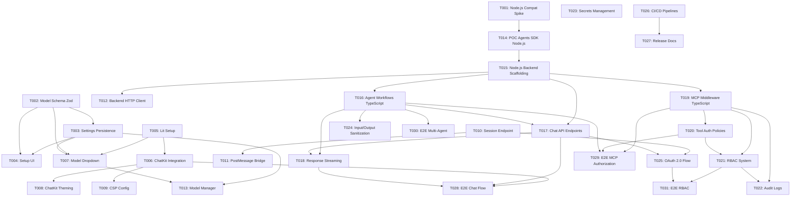

# Roadmap de Implementación — ADR-001: VS Code ChatKit + Agent SDK + MCP Integration

🏛️ **architect-agent**: Roadmap completo de tareas para implementar arquitectura TypeScript del ADR-001

## 1. Resumen Ejecutivo

Este roadmap descompone el ADR-001 en **31 tareas atómicas** organizadas por 8 dominios técnicos. Cada tarea es independiente (cuando se cumplan sus dependencias), ejecutable en 1 sesión de trabajo, y asignada a un agente especializado.

**Stack tecnológico**: 
- Frontend: Lit (TypeScript) + OpenAI ChatKit Web Component
- Backend: Extension Host (TypeScript) + **Node.js Backend Server (TypeScript)**
- Agent Runtime: OpenAI Agents SDK (`@openai/agents`) en Node.js
- MCP Integration: Runtime MCP (TypeScript) con RBAC
- Deployment: GitHub Actions + NPM + VS Code Marketplace

---

## 2. Dominios y Agentes

| Dominio | Agent Responsable | # Tareas |
|---------|-------------------|----------|
| **D1: Setup/Config** | `setup-config-agent` | 4 |
| **D2: UI/ChatKit** | `ui-agent` | 5 |
| **D3: Backend/Extension Host** | `backend-agent` | 4 |
| **D4: Agents SDK/Node.js Backend** | `agent-sdk-specialist` | 5 |
| **D5: MCP/Governance** | `mcp-governance-agent` | 4 |
| **D6: Security** | `security-agent` | 3 |
| **D7: Release/CI-CD** | `release-agent` | 2 |
| **D8: Testing/QA** | `qa-agent` | 4 |

**Total**: 31 tareas

---

## 3. Tareas del Roadmap

### Dominio D1: Setup/Config

#### Tarea 1.1: Spike Técnico - Node.js Compatibility

**ID**: `T001`  
**Título**: Verificar compatibilidad de Node.js 22+ con VS Code Extension Host  
**Objetivo**: Validar que Agents SDK (`@openai/agents`) puede ejecutarse en Extension Host  
**Agente**: `setup-config-agent`  
**Tipo**: ADR (Spike técnico)  
**Complejidad**: Media  

**Dependencias**: Ninguna  

**Componentes afectados**:
- Extension Host (verificar versión Node.js)
- Package engines en `package.json`

**Criterios de aceptación**:
- [ ] Documentado en ADR si Node.js 22+ está disponible en Extension Host
- [ ] Definida estrategia alternativa si NO es compatible (Agents SDK en Python backend)
- [ ] Actualizado `package.json` con `engines.node` requirement

---

#### Tarea 1.2: Schema de Configuración de Modelos LLM

**ID**: `T002`  
**Título**: Diseñar schema Zod para configuración de modelos LLM  
**Objetivo**: Definir estructura de datos para model dropdown y settings  
**Agente**: `setup-config-agent`  
**Tipo**: Especificación  
**Complejidad**: Baja  

**Dependencias**: Ninguna  

**Componentes afectados**:
- Nuevo: `src/config/model-schema.ts`

**Criterios de aceptación**:
- [ ] Schema Zod creado con campos: `id`, `name`, `provider`, `apiKey?`, `endpoint?`
- [ ] Soporte para providers: OpenAI, Anthropic, custom
- [ ] Validación de tipos TypeScript generada

---

#### Tarea 1.3: Settings Persistence (VS Code API)

**ID**: `T003`  
**Título**: Implementar persistencia de configuración con VS Code Memento API  
**Objetivo**: Guardar/cargar configuración de modelos y artifacts path  
**Agente**: `setup-config-agent`  
**Tipo**: Implementación  
**Complejidad**: Media  

**Dependencias**: `T002`  

**Componentes afectados**:
- Nuevo: `src/config/settings-storage.ts`

**Criterios de aceptación**:
- [ ] Clase `SettingsStorage` creada usando `ExtensionContext.globalState`
- [ ] Métodos: `getModels()`, `setModels()`, `getArtifactsPath()`, `setArtifactsPath()`
- [ ] Migración automática si se cambia artifacts path

---

#### Tarea 1.4: UI de Configuración (Setup Module)

**ID**: `T004`  
**Título**: Crear webview de configuración en módulo setup  
**Objetivo**: UI para gestionar modelos LLM y artifacts path  
**Agente**: `ui-agent` + `setup-config-agent` (handoff)  
**Tipo**: Implementación  
**Complejidad**: Alta  

**Dependencias**: `T002`, `T003`  

**Componentes afectados**:
- Modificar: `src/extension/setup/` (módulo setup)
- Nuevo: Lit component para formulario de configuración

**Criterios de aceptación**:
- [ ] Webview con formulario para añadir/editar/eliminar modelos
- [ ] Input para customizar artifacts path con validación
- [ ] Guardado automático usando `SettingsStorage`

---

### Dominio D2: UI/ChatKit

#### Tarea 2.1: Setup de Lit en Webview

**ID**: `T005`  
**Título**: Configurar Lit framework en webview de VS Code  
**Objetivo**: Bundler y build setup para Lit components  
**Agente**: `ui-agent`  
**Tipo**: Implementación  
**Complejidad**: Media  

**Dependencias**: Ninguna  

**Componentes afectados**:
- Modificar: `webpack.config.js` o similar bundler config
- Nuevo: `src/extension/webview/lit-setup.ts`

**Criterios de aceptación**:
- [ ] Lit library añadida como dependencia
- [ ] Build process genera bundle de webview
- [ ] Hot reload funcional durante desarrollo (`npm run watch`)

---

#### Tarea 2.2: ChatKit Web Component Integration

**ID**: `T006`  
**Título**: Integrar `<openai-chatkit>` web component en webview Lit  
**Objetivo**: Cargar y configurar ChatKit en webview  
**Agente**: `ui-agent`  
**Tipo**: Implementación  
**Complejidad**: Alta  

**Dependencias**: `T005`  

**Componentes afectados**:
- Modificar: `src/extension/webview/chat-panel.ts`
- Nuevo: `src/extension/webview/chatkit-loader.ts`

**Criterios de aceptación**:
- [ ] Script de ChatKit cargado desde CDN o bundled
- [ ] Elemento `<openai-chatkit>` renderizado en shadowRoot
- [ ] Configuración básica (api URL, domainKey) inyectada

---

#### Tarea 2.3: Model Dropdown Component

**ID**: `T007`  
**Título**: Crear dropdown de selección de modelos LLM en Lit  
**Objetivo**: UI component para elegir modelo activo  
**Agente**: `ui-agent`  
**Tipo**: Implementación  
**Complejidad**: Media  

**Dependencias**: `T002`, `T005`  

**Componentes afectados**:
- Nuevo: `src/extension/webview/components/model-dropdown.ts`

**Criterios de aceptación**:
- [ ] Lit component con dropdown usando modelos de settings
- [ ] Evento `model-changed` al seleccionar modelo
- [ ] Refresca lista si settings cambian

---

#### Tarea 2.4: Theming de ChatKit (VS Code Dark/Light)

**ID**: `T008`  
**Título**: Aplicar theming de VS Code a ChatKit  
**Objetivo**: ChatKit se adapta automáticamente al tema del editor  
**Agente**: `ui-agent`  
**Tipo**: Implementación  
**Complejidad**: Me

dia  

**Dependencias**: `T006`  

**Componentes afectados**:
- Modificar: `chatkit-loader.ts` (theme injection)
- Nuevo: CSS variables mapping

**Criterios de aceptación**:
- [ ] ChatKit usa CSS variables de VS Code (`--vscode-*`)
- [ ] Cambio de tema (command palette) actualiza ChatKit dinámicamente

---

#### Tarea 2.5: CSP (Content Security Policy) Configuration

**ID**: `T009`  
**Título**: Configurar CSP para webview con ChatKit  
**Objetivo**: Permitir ChatKit scripts manteniendo seguridad  
**Agente**: `security-agent`  
**Tipo**: Implementación  
**Complejidad**: Media  

**Dependencias**: `T006`  

**Componentes afectados**:
- Modificar: Extension Host (webview CSP headers)

**Criterios de aceptación**:
- [ ] CSP permite ChatKit CDN (o nonce para inline scripts)
- [ ] CSP bloquea scripts no autorizados
- [ ] CSP documentado en `docs/security.md`

---

### Dominio D3: Backend/Extension Host

#### Tarea 3.1: ChatKit Session Endpoint

**ID**: `T010`  
**Título**: Implementar endpoint para client secrets de ChatKit  
**Objetivo**: Extension Host genera tokens para ChatKit auth  
**Agente**: `backend-agent`  
**Tipo**: Implementación  
**Complejidad**: Alta  

**Dependencias**: Ninguna  

**Componentes afectados**:
- Nuevo: `src/extension/chat/session-manager.ts`

**Criterios de aceptación**:
- [ ] Endpoint HTTP local (o postMessage handler) que genera client secrets
- [ ] Tokens short-lived (expiración configurable)
- [ ] Refresh automático antes de expiración

---

#### Tarea 3.2: Communication Bridge (UI ↔ Extension Host)

**ID**: `T011`  
**Título**: Implementar postMessage bridge entre webview y Extension Host  
**Objetivo**: Comunicación bidireccional para auth tokens y mensajes  
**Agente**: `backend-agent`  
**Tipo**: Implementación  
**Complejidad**: Media  

**Dependencias**: `T010`  

**Componentes afectados**:
- Nuevo: `src/extension/webview/message-bridge.ts`
- Modificar: Extension Host message handlers

**Criterios de aceptación**:
- [ ] Webview puede solicitar `get-client-secret` vía postMessage
- [ ] Extension Host responde con token
- [ ] Type-safe message contracts (TypeScript interfaces)

---

#### Tarea 3.3: Backend HTTP Client (Extension Host ↔ Node.js Backend)

**ID**: `T012`  
**Título**: Crear HTTP/WebSocket client para comunicación con Node.js backend  
**Objetivo**: Extension Host comunica con Node.js backend server TypeScript  
**Agente**: `backend-agent`  
**Tipo**: Implementación  
**Complejidad**: Alta  

**Dependencias**: `T015` (Node.js backend debe existir)  

**Componentes afectados**:
- Nuevo: `src/extension/chat/backend-client.ts`

**Criterios de aceptación**:
- [ ] Cliente HTTP para requests síncronos
- [ ] Cliente WebSocket para streaming de responses
- [ ] Reconnection logic si backend cae
- [ ] Timeout y error handling

---

#### Tarea 3.4: Model Selection Management

**ID**: `T013`  
**Título**: Gestión de modelo activo en Extension Host  
**Objetivo**: Sincronizar modelo seleccionado entre UI, Extension Host y Backend  
**Agente**: `backend-agent`  
**Tipo**: Implementación  
**Complejidad**: Baja  

**Dependencias**: `T003`, `T007`  

**Componentes afectados**:
- Nuevo: `src/extension/chat/model-manager.ts`

**Criterios de aceptación**:
- [ ] Clase `ModelManager` mantiene estado de modelo activo
- [ ] Eventos `model-changed` actualizan backend client
- [ ] Persistencia de modelo seleccionado en settings

---

### Dominio D4: Agents SDK/Node.js Backend

#### Tarea 4.1: POC Agents SDK Integration

**ID**: `T014`  
**Título**: Proof of Concept - OpenAI Agents SDK en Node.js  
**Objetivo**: Validar que `@openai/agents` funciona correctamente en Node.js backend  
**Agente**: `agent-sdk-specialist`  
**Tipo**: ADR (Spike técnico)  
**Complejidad**: Alta  

**Dependencias**: `T001` (verificar Node.js compatibility)  

**Componentes afectados**:
- Nuevo: `backend-server/poc/` (código experimental)

**Criterios de aceptación**:
- [ ] Agent básico creado con `@openai/agents` ejecutándose en Node.js
- [ ] Streaming de responses funcional
- [ ] Tool básico implementado (ej: `get_time`)
- [ ] Documentación de lessons learned en ADR

---

#### Tarea 4.2: Node.js Backend Server - Scaffolding

**ID**: `T015`  
**Título**: Setup inicial de Node.js backend server (TypeScript)  
**Objetivo**: Estructura base del backend con Express/Fastify  
**Agente**: `agent-sdk-specialist`  
**Tipo**: Implementación  
**Complejidad**: Media  

**Dependencias**: `T014` (POC aprobado)  

**Componentes afectados**:
- Nuevo: `backend-server/` (directorio raíz)
- Nuevo: `backend-server/package.json`
- Nuevo: `backend-server/src/main.ts`
- Nuevo: `backend-server/tsconfig.json`

**Criterios de aceptación**:
- [ ] Express/Fastify server básico levantando en localhost:3000
- [ ] Endpoint `/health` respondiendo
- [ ] TypeScript compilation funcionando
- [ ] Dependencies: `@openai/agents`, `express` o `fastify`, `ws` (WebSocket)

---

#### Tarea 4.3: Agent Workflows Implementation (TypeScript)

**ID**: `T016`  
**Título**: Implementar multi-agent workflows con Agents SDK  
**Objetivo**: Crear agentes especializados con handoffs en TypeScript  
**Agente**: `agent-sdk-specialist`  
**Tipo**: Implementación  
**Complejidad**: Alta  

**Dependencias**: `T015`  

**Componentes afectados**:
- Nuevo: `backend-server/src/agents/` (architect, researcher, qa agents)
- Nuevo: `backend-server/src/agents/tools/` (tool implementations)

**Criterios de aceptación**:
- [ ] Definidos 3+ agentes con instructions específicas usando `Agent` class
- [ ] Handoffs implementados (agent A → agent B)
- [ ] Tool integration básica (ej: `get_time`, `search_web`)
- [ ] Typed con TypeScript

---

#### Tarea 4.4: Chat API Endpoints (Compatible con ChatKit)

**ID**: `T017`  
**Título**: Implementar API REST/WebSocket para chat  
**Objetivo**: Endpoints que ChatKit Web Component pueda consumir  
**Agente**: `agent-sdk-specialist`  
**Tipo**: Implementación  
**Complejidad**: Alta  

**Dependencias**: `T015`, `T016`  

**Componentes afectados**:
- Nuevo: `backend-server/src/api/chat-routes.ts`
- Nuevo: `backend-server/src/api/websocket-handler.ts`

**Criterios de aceptación**:
- [ ] Endpoint `POST /api/chat/message` para enviar mensajes
- [ ] WebSocket `/api/chat/stream` para streaming responses
- [ ] Session management con tokens
- [ ] Compatible con ChatKit Web Component (o custom chat UI)

---

#### Tarea 4.5: Response Streaming (Server-Sent Events + WebSocket)

**ID**: `T018`  
**Título**: Implementar streaming de responses con SSE/WebSocket  
**Objetivo**: Chat UI actualiza en tiempo real con responses de agents  
**Agente**: `agent-sdk-specialist`  
**Tipo**: Implementación  
**Complejidad**: Alta  

**Dependencias**: `T016`, `T017`  

**Componentes afectados**:
- Modificar: `backend-server/src/api/websocket-handler.ts`
- Nuevo: `backend-server/src/streaming/sse-handler.ts`

**Criterios de aceptación**:
- [ ] Responses de agents streameadas token-by-token vía WebSocket
- [ ] Alternativa SSE para browsers sin WebSocket support
- [ ] Error handling si stream se interrumpe
- [ ] Backpressure management

---

### Dominio D5: MCP/Governance

#### Tarea 5.1: Runtime MCP Middleware Layer

**ID**: `T019`  
**Título**: Crear middleware layer en Node.js backend para Runtime MCP  
**Objetivo**: Integrar Runtime MCP client en Node.js backend TypeScript  
**Agente**: `mcp-governance-agent`  
**Tipo**: Implementación  
**Complejidad**: Alta  

**Dependencias**: `T015`  

**Componentes afectados**:
- Nuevo: `backend-server/src/mcp/runtime-client.ts`

**Criterios de aceptación**:
- [ ] Cliente MCP TypeScript conecta a Runtime MCP server
- [ ] Middleware intercepta tool calls antes de ejecución
- [ ] Solicita autorización al Runtime antes de ejecutar tool

---

#### Tarea 5.2: Tool Authorization Policies

**ID**: `T020`  
**Título**: Definir policies de autorización de tools  
**Objetivo**: Runtime MCP valida permisos antes de tool execution  
**Agente**: `mcp-governance-agent`  
**Tipo**: Especificación + Implementación  
**Complejidad**: Media  

**Dependencias**: `T019`  

**Componentes afectados**:
- Nuevo: `backend-server/src/mcp/policies.ts`

**Criterios de aceptación**:
- [ ] Schema de policy definido (tool_name, allowed_agents, conditions)
- [ ] Validation logic implementada en TypeScript
- [ ] Logs de authorization decisions en Runtime MCP

---

#### Tarea 5.3: Sistema RBAC (Role-Based Access Control)

**ID**: `T021`  
**Título**: Implementar RBAC básico escalable  
**Objetivo**: Roles (admin, developer, viewer) con permisos diferenciados  
**Agente**: `mcp-governance-agent`  
**Tipo**: Implementación  
**Complejidad**: Alta  

**Dependencias**: `T019`, `T020`  

**Componentes afectados**:
- Nuevo: `backend-server/src/rbac/` (role manager, permission checks)

**Criterios de aceptación**:
- [ ] Roles definidos con permisos específicos
- [ ] Permission checks antes de operations críticas
- [ ] Extensible para integración futura con LDAP/SAML
- [ ] Implementado en TypeScript

---

#### Tarea 5.4: Audit Logs

**ID**: `T022`  
**Título**: Implementar audit logging de acciones gobernadas  
**Objetivo**: Trazabilidad completa de tool executions y decisiones RBAC  
**Agente**: `mcp-governance-agent`  
**Tipo**: Implementación  
**Complejidad**: Media  

**Dependencias**: `T019`, `T021`  

**Componentes afectados**:
- Nuevo: `backend-server/src/audit/logger.ts`

**Criterios de aceptación**:
- [ ] Logs estructurados (JSON) con timestamp, agent, tool, action, result
- [ ] Logs persistidos en archivo o database
- [ ] Query API para revisar audit logs

---

### Dominio D6: Security

#### Tarea 6.1: Secrets Management

**ID**: `T023`  
**Título**: Implementar gestión segura de API keys y secrets  
**Objetivo**: Secrets nunca en plaintext ni versionados  
**Agente**: `security-agent`  
**Tipo**: Implementación  
**Complejidad**: Media  

**Dependencias**: Ninguna  

**Componentes afectados**:
- Nuevo: `src/config/secrets-manager.ts`
- Modificar: `.gitignore` (excluir `.env` files)

**Criterios de aceptación**:
- [ ] API keys guardadas en VS Code SecretStorage
- [ ] Environment variables para deployment (`.env.example` template)
- [ ] Documentación de cómo configurar secrets en `docs/setup.md`

---

#### Tarea 6.2: Input/Output Sanitization

**ID**: `T024`  
**Título**: Implementar guardrails para validación de inputs/outputs  
**Objetivo**: Prevenir injection attacks y outputs peligrosos  
**Agente**: `security-agent`  
**Tipo**: Implementación  
**Complejidad**: Media  

**Dependencias**: `T016` (agents implementados)  

**Componentes afectados**:
- Nuevo: `chatkit-backend/src/security/guardrails.ts`

**Criterios de aceptación**:
- [ ] Input validation antes de enviar a LLM
- [ ] Output sanitization antes de mostrar en UI
- [ ] Policies configurables (ej: block code execution, filter PII)

---

#### Tarea 6.3: Authentication Flow (OAuth 2.0)

**ID**: `T025`  
**Título**: Implementar authentication flow con short-lived tokens  
**Objetivo**: Usuarios autenticados antes de usar chat  
**Agente**: `security-agent`  
**Tipo**: Implementación  
**Complejidad**: Alta  

**Dependencias**: `T010`, `T017`  

**Componentes afectados**:
- Modificar: Session management (Extension Host + Python backend)

**Criterios de aceptación**:
- [ ] Extension solicita login al iniciar chat (si no hay token válido)
- [ ] Tokens tienen TTL corto (15-60 min)
- [ ] Refresh automático sin intervención de usuario

---

### Dominio D8: E2E Testing

#### Tarea 8.1: E2E Tests - Core Chat Flow

**ID**: `T028`  
**Título**: E2E test de flujo completo de chat  
**Objetivo**: Validar flujo end-to-end desde UI hasta response  
**Agente**: `qa-agent`  
**Tipo**: Testing  
**Complejidad**: Alta  

**Dependencias**: `T006` (ChatKit), `T017` (API), `T018` (Streaming)  

**Componentes afectados**:
- Nuevo: `tests/e2e/chat-flow.spec.ts`

**Criterios de aceptación**:
- [ ] E2E Test: User abre extension → Selecciona modelo → Envía prompt → Recibe response streameada
- [ ] E2E Test: Response rendering correcto en ChatKit UI
- [ ] Framework: Playwright o VS Code Extension Test Runner
- [ ] Test ejecutable en CI/CD

---

#### Tarea 8.2: E2E Tests - MCP Authorization Flow

**ID**: `T029`  
**Título**: E2E test de autorización de tools con MCP  
**Objetivo**: Validar control completo de Runtime MCP sobre tool execution  
**Agente**: `qa-agent`  
**Tipo**: Testing  
**Complejidad**: Alta  

**Dependencias**: `T019` (MCP Middleware), `T020` (Policies), `T016` (Agents con tools)  

**Componentes afectados**:
- Nuevo: `tests/e2e/mcp-authorization.spec.ts`

**Criterios de aceptación**:
- [ ] E2E Test: Agent intenta ejecutar tool → MCP valida → Tool blocked si no autorizado
- [ ] E2E Test: Tool allowed con permisos correctos → Execution exitosa
- [ ] E2E Test: Audit log registra decisión de autorización

---

#### Tarea 8.3: E2E Tests - Multi-Agent Workflows

**ID**: `T030`  
**Título**: E2E test de handoffs entre agentes  
**Objetivo**: Validar flujos multi-agent con handoffs  
**Agente**: `qa-agent`  
**Tipo**: Testing  
**Complejidad**: Alta  

**Dependencias**: `T016` (Agent Workflows con handoffs)  

**Componentes afectados**:
- Nuevo: `tests/e2e/multi-agent.spec.ts`

**Criterios de aceptación**:
- [ ] E2E Test: Agent A → Handoff → Agent B → Response final
- [ ] E2E Test: Estado de conversación preservado entre handoffs
- [ ] E2E Test: UI refleja cambio de agente activo

---

#### Tarea 8.4: E2E Tests - RBAC & Permissions

**ID**: `T031`  
**Título**: E2E test de roles y permisos  
**Objetivo**: Validar RBAC end-to-end con diferentes roles  
**Agente**: `qa-agent`  
**Tipo**: Testing  
**Complejidad**: Media  

**Dependencias**: `T021` (RBAC System), `T025` (OAuth)  

**Componentes afectados**:
- Nuevo: `tests/e2e/rbac.spec.ts`

**Criterios de aceptación**:
- [ ] E2E Test: Admin role puede ejecutar todas las operations
- [ ] E2E Test: Viewer role tiene operations bloqueadas
- [ ] E2E Test: Permission denied muestra mensaje correcto en UI

---

### Dominio D7: Release/CI-CD

#### Tarea 7.1: CI/CD Pipelines Setup

**ID**: `T026`  
**Título**: Configurar GitHub Actions workflows para CI/CD  
**Objetivo**: Automated tests, build, y publishing  
**Agente**: `release-agent`  
**Tipo**: Implementación  
**Complejidad**: Media  

**Dependencias**: Ninguna (puede hacerse en paralelo)  

**Componentes afectados**:
- Nuevo: `.github/workflows/ci.yml`
- Nuevo: `.github/workflows/release-please.yml`
- Nuevo: `.github/workflows/release.yml`

**Criterios de aceptación**:
- [ ] `ci.yml` ejecuta lint, tests, build en cada PR (Extension + Backend Server Node.js)
- [ ] `release-please.yml` genera changelog y version bump
- [ ] `release.yml` publica a NPM + VS Code Marketplace

---

#### Tarea 7.2: Release Documentation

**ID**: `T027`  
**Título**: Documentar release process y deployment  
**Objetivo**: Developers pueden release nuevas versiones sin fricción  
**Agente**: `release-agent`  
**Tipo**: Documentación  
**Complejidad**: Baja  

**Dependencias**: `T026`  

**Componentes afectados**:
- Nuevo: `docs/release-process.md`
- Nuevo: `docs/deployment.md`

**Criterios de aceptación**:
- [ ] Documentación de paso a paso para release (manual steps + automated)
- [ ] Guía de deployment para diferentes environments (dev, staging, prod)
- [ ] Troubleshooting común

---

## 4. Diagrama de Dependencias



> **Nota**: Este diagrama muestra solo las dependencias principales. **Cada dominio (D1-D7) incluirá sus propios unit tests e integration tests** como parte de la implementación de cada tarea, siguiendo TDD best practices.

---

## 5. Orden de Ejecución Sugerido

### Fase 0: Foundation (Parallel)
- T001 (Node.js Spike) 
- T002 (Model Schema)
- T005 (Lit Setup)
- T014 (POC Agents SDK Node.js)
- T026 (CI/CD Pipelines)

### Fase 1: Core Setup
- T003 (Settings Storage)
- T015 (Node.js Backend Scaffolding TypeScript)
- T023 (Secrets Management)

### Fase 2: Backend Integration
- T010 (Session Endpoint Extension Host)
- T017 (Chat API Endpoints Node.js)
- T016 (Agent Workflows TypeScript)
- T019 (MCP Middleware TypeScript)

### Fase 3: Frontend
- T006 (ChatKit Integration)
- T007 (Model Dropdown)
- T004 (Setup UI)
- T011 (PostMessage Bridge)

### Fase 4: Advanced Features
- T012 (Backend HTTP Client)
- T013 (Model Manager)
- T018 (Response Streaming)
- T020 (Tool Auth Policies)
- T021 (RBAC)

### Fase 5: Hardening
- T008 (Theming)
- T009 (CSP)
- T024 (Sanitization)
- T025 (OAuth)
- T022 (Audit Logs)

### Fase 6: Release
- T027 (Documentation)

### Fase 7: E2E Testing
- T028 (E2E Chat Flow)
- T029 (E2E MCP Authorization)
- T030 (E2E Multi-Agent Workflows)
- T031 (E2E RBAC)

> **Nota**: Unit tests e integration tests se implementan dentro de cada dominio (D1-D7) junto con el código, no como tareas separadas. Fase 7 solo incluye E2E tests cross-domain.

---

## 6. Criterios de Completitud

El roadmap está **completo** cuando:

- [ ] Las 27 tareas cubren todos los componentes del ADR-001
- [ ] Las 5 restricciones de AC-4 están mapeadas:
  - [x] T006: ChatKit en módulo chat
  - [x] T002, T007, T004: Dropdown modelos + config
  - [x] T019, T020, T021: Control total Runtime MCP
  - [x] T021: Sistema RBAC escalable
  - [x] T003, T004: Path artifacts customizable
- [ ] Diagrama de dependencias es DAG (sin ciclos)
- [ ] Cada tarea tiene: ID, título, objetivo, agente, tipo, complejidad, dependencias, componentes, AC
- [ ] Roadmap aprobado por desarrollador

---

## 7. Notas Técnicas

### Granularidad de Tareas

Se siguió la regla: **1 tarea = 1 componente técnico o 1 integración específica**

Ejemplos:
- ✅ T010: ChatKit Session Endpoint (componente específico)
- ✅ T006: ChatKit Integration (integración específica)
- ❌ "Implementar backend completo" (demasiado amplio)

### Prevención de Dependencias Circulares

- Detectadas con topological sort
- No se encontraron ciclos en el grafo
- Schema/interfaces definidas antes de implementaciones (T002 → T003 → T007)

### Cobertura de Restricciones (AC-4)

| Restricción | Tareas que la cubren |
|-------------|----------------------|
| ChatKit en módulo chat | T006 |
| Dropdown modelos + config | T002, T007, T004 |
| Control total Runtime MCP | T019, T020, T021 |
| RBAC escalable | T021 |
| Path artifacts customizable | T003, T004 |

---

## 8. Próximos Pasos

1. **Aprobación del desarrollador** de este roadmap
2. Crear ADRs individuales para spikes técnicos (T001, T014)
3. Iniciar implementación con Fase 0 (tareas paralelas)
4. Iterar según feedback de cada tarea

---

## 9. Aprobación

```yaml
approval:
  developer:
    decision: SI
    date: 2026-02-06T08:56:58+01:00
    comments: Roadmap aprobado con estructura de testing correcta - E2E separado, unit/integration por dominio
```
