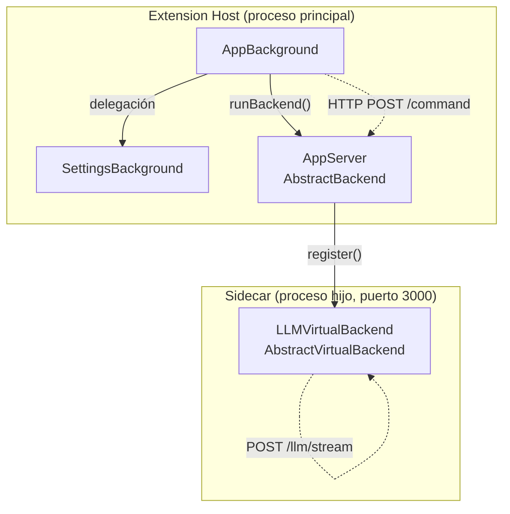
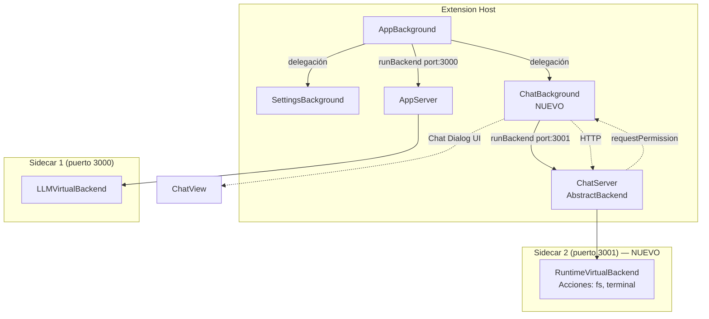

# T032: Servidor Runtime & Sandbox de Acciones - Investigación Profunda

🔬 **researcher-agent**

## 1. Mapa de Arquitectura Actual

### 1.1 Estructura de Módulos
```
src/extension/modules/
├── core/           ← Abstracciones base (Backend, Background, View)
├── app/            ← Shell de la aplicación (orquestador)
├── auth/           ← Autenticación (OAuth, API Keys)
├── settings/       ← Registro de Modelos, Roles, UI
└── llm/            ← Factory de Agentes LLM
```

### 1.2 Capas por Módulo (Constitución Modular)
```
┌──────────────┐
│  View (Lit)  │  ← UI en Webview (Shadow DOM)
├──────────────┤
│  Background  │  ← Controlador (Extension Host, acceso a vscode API)
├──────────────┤
│  Backend     │  ← Servidor Fastify (Sidecar, proceso hijo separado)
└──────────────┘
```

### 1.3 Patrón de Servidor Actual



**Clases clave:**
| Clase | Tipo | Archivo | Función |
|---|---|---|---|
| `AbstractBackend` | Físico | `core/backend/abstract-server.ts` | Servidor Fastify independiente (tiene su propio `listen()` en puerto) |
| `AbstractVirtualBackend` | Virtual | `core/backend/virtual-server.ts` | Plugin de rutas sobre un servidor físico existente |
| `AppServer` | Físico | `app/backend/index.ts` | Sidecar principal (puerto 3000). Host de virtual backends |
| `LLMVirtualBackend` | Virtual | `llm/backend/index.ts` | Registra rutas `/llm/run` y `/llm/stream` en AppServer |
| `Background` | Host | `core/background/index.ts` | Spawna sidecar (`runBackend()`), gestiona IPC HTTP y webview |

### 1.4 Flujo de Spawn del Sidecar
```typescript
// En AppBackground.constructor():
const scriptPath = 'dist-backend/.../app/backend/index.js';
this.runBackend(scriptPath, 3000); // Hereda de Background (core)
```
`Background.runBackend()` usa `child_process.spawn()` con Node.js para ejecutar el script del servidor.

---

## 2. Propuesta: Nuevo Módulo Chat con Servidor Dedicado

### 2.1 ¿Por qué un servidor físico separado?
- **Aislamiento**: Las acciones del Chat (File I/O, Terminal) NO deben compartir proceso con el LLM.
- **Estabilidad**: Si el Runtime crashea, el LLM sigue funcionando.
- **Escalabilidad**: Cada servidor puede tener sus propios recursos y timeout.
- **Seguridad**: El Sandbox lógico se aplica SOLO al servidor de acciones.

### 2.2 Arquitectura Propuesta



### 2.3 Estructura del Módulo Chat (Propuesta)
```
src/extension/modules/chat/
├── constants.ts          ← NAME, MESSAGES, SCOPES
├── index.ts              ← IModule definition
├── background/
│   └── index.ts          ← ChatBackground (spawna ChatServer)
├── backend/
│   ├── index.ts          ← ChatServer (AbstractBackend, puerto 3001)
│   ├── runtime/
│   │   ├── index.ts      ← RuntimeVirtualBackend (acciones)
│   │   ├── actions/
│   │   │   ├── fs.ts     ← readFile, writeFile, listFiles, deleteFile
│   │   │   ├── terminal.ts ← runCommand
│   │   │   └── vscode.ts ← openFile
│   │   ├── permission.ts ← PermissionEngine (skill validation)
│   │   └── types.ts      ← ActionRequest, ActionResult, PermissionRequest
│   └── session/
│       └── index.ts      ← Gestión de sesiones de chat (existente o nuevo)
└── view/
    ├── index.ts          ← ChatView (Lit component)
    └── templates/
        ├── main/         ← Mensajes, input
        └── dialogs/      ← Permission dialogs (Allow/Deny)
```

---

## 3. Análisis Técnico

### 3.1 IPC: HTTP vs JSON-RPC

| Criterio | HTTP (actual) | JSON-RPC (vscode-jsonrpc) |
|---|---|---|
| Patrón actual | ✅ Ya implementado en `AbstractBackend` | ❌ Requeriría cambiar `AbstractBackend` |
| Bidireccionalidad | ❌ Solo Host → Sidecar | ✅ Sidecar → Host (para permisos) |
| Streaming | ✅ SSE sobre HTTP | ✅ Notifications |
| Complejidad | Baja | Media |

**Problema clave**: El patrón actual (HTTP POST `/command`) es **unidireccional** (Host → Sidecar). Para el Sandbox necesitamos que el **Sidecar pida permiso al Host** (bidireccional).

**Opciones**:
1. **WebSocket** adicional para callbacks del Sidecar al Host.
2. **Long-polling** en el Sidecar esperando respuesta de permiso.
3. **JSON-RPC sobre IPC** (reemplazar HTTP para el nuevo servidor).
4. **Callback HTTP inverso**: El Host expone un mini-servidor para recibir peticiones del Sidecar.

**Recomendación**: Mantener HTTP para el `AppServer` existente (no romper nada), pero para el **ChatServer** usar un enfoque mixto:
- Host → ChatServer: HTTP (consistente con el patrón).
- ChatServer → Host para permisos: **WebSocket** o **vscode-jsonrpc sobre IPC** del `child_process`.

### 3.2 Modelo de Permisos (Security)

```typescript
// Flujo de ejecución de una acción
interface ActionPipeline {
  1: 'Agent genera Tool Call (output del LLM)';
  2: 'ChatBackground intercepta el Tool Call';
  3: 'ChatBackground verifica skill del Agente (role markdown)';
  4: 'Si requiere permiso → ChatView muestra diálogo';
  5: 'Usuario aprueba/deniega';
  6: 'Si aprobado → ChatBackground envía al ChatServer';
  7: 'ChatServer ejecuta la acción (fs/terminal)';
  8: 'Resultado vuelve al ChatBackground';
  9: 'ChatBackground lo envía de vuelta al LLM como Tool Result';
}
```

**Niveles de riesgo por acción**:
| Acción | Riesgo | Permiso Default |
|---|---|---|
| `fs.readFile` | 🟢 Bajo | Auto-permitido |
| `fs.listFiles` | 🟢 Bajo | Auto-permitido |
| `fs.writeFile` | 🟡 Medio | Requiere aprobación |
| `fs.deleteFile` | 🔴 Alto | Requiere aprobación |
| `fs.createDirectory` | 🟢 Bajo | Auto-permitido |
| `terminal.runCommand` | 🔴 Alto | Requiere aprobación |
| `vscode.openFile` | 🟢 Bajo | Auto-permitido (se ejecuta en Host) |

### 3.3 Skill Validation (Markdown)

Formato propuesto para `.agent/rules/roles/*.md`:
```yaml
capabilities:
  skills:
    - fs.read
    - fs.write
    - terminal
  tools:
    git: supported
```

El `PermissionEngine` lee las skills del agente activo y valida contra la acción solicitada.

---

## 4. Dependencias Identificadas

| Dependencia | Impacto | Estado |
|---|---|---|
| Chat UI (módulo `chat/view`) | Necesario para diálogos de permiso | **NO EXISTE** — Debe crearse |
| Chat Background | Necesario para orquestar acciones | **NO EXISTE** — Debe crearse |
| `AbstractBackend` (core) | Base para ChatServer | ✅ Existe |
| `AbstractVirtualBackend` (core) | Base para RuntimeVirtualBackend | ✅ Existe |
| `Background.runBackend()` (core) | Para spawnar segundo sidecar | ✅ Existe |
| Role Markdowns | Para skill validation | ✅ Existen (necesitan campo `skills`) |

---

## 5. Riesgos y Mitigaciones

1. **Dos sidecars**: Gestionar dos procesos hijos (puertos 3000 y 3001). **Mitigación**: `Background.runBackend()` ya soporta esto.
2. **Bidireccionalidad IPC**: El patrón HTTP actual no soporta callbacks. **Mitigación**: Usar IPC nativo del `child_process` para callbacks de permisos.
3. **Scope de la tarea**: Crear un módulo Chat completo + Runtime es grande. **Mitigación**: Dividir en sub-tareas incrementales.

---

## 6. Recomendación Final

> **Crear el módulo `chat` como un nuevo módulo completo (Background + Backend + View) con su propio servidor físico dedicado (puerto 3001). El Runtime de Acciones será un VirtualBackend dentro de este servidor.**

Esto respeta la constitución modular, aísla las acciones del LLM, y permite escalar independientemente.
