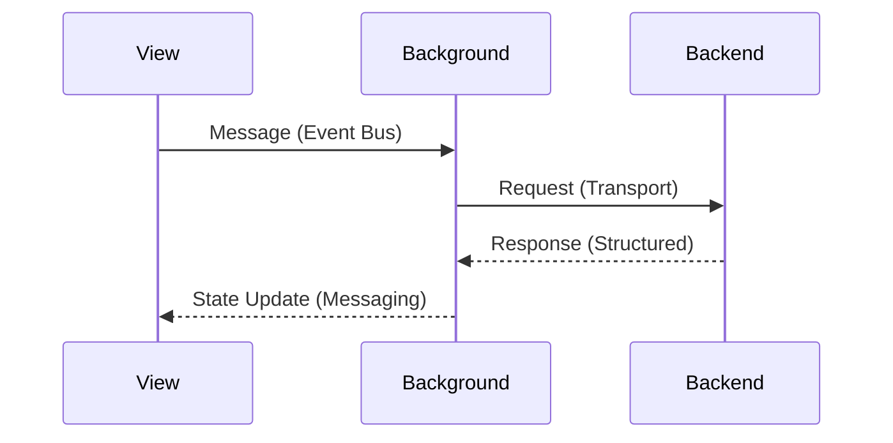

# Coding Integration Report — {{taskId}}-{{taskTitle}}

## 1. Layer Reports Summary

| Layer | Agent | Status | Gate |
|-------|-------|--------|------|
| Backend | {{backend_agent}} | {{status}} | SI / NO / N/A |
| Background | {{background_agent}} | {{status}} | SI / NO / N/A |
| View | {{view_agent}} | {{status}} | SI / NO / N/A |

---

## 2. Communication Validation Matrix

| Path | Method | Contract | Status |
|------|--------|----------|--------|
| View → Background | `core/messaging` Event Bus | `Message` interface | ✅ / ❌ |
| Background → Backend | Abstract transport / direct | Structured response | ✅ / ❌ |
| Background → View | `core/messaging` response | `Message` interface | ✅ / ❌ |
| View → Backend | **FORBIDDEN** | N/A | ✅ (no path) / ❌ (violation) |

### Validation Details
- (Describe each communication path validated)
- (Note any deviations or issues found and how they were resolved)

---

## 3. Constitution Compliance

### Backend (`constitution.backend`)
- [ ] Extends `AbstractServer`
- [ ] No `vscode` or `dom` imports
- [ ] Transport agnostic
- [ ] Structured error handling
- [ ] No direct View communication

### Background (`constitution.background`)
- [ ] Registered via `App.register()`
- [ ] Uses `core/messaging` for View communication
- [ ] Manages lifecycle correctly
- [ ] Gateway role maintained

### View (`constitution.view`)
- [ ] Lit with `@customElement`
- [ ] Triad structure (index/html/styles)
- [ ] No business logic
- [ ] Communication via Messaging wrapper

---

## 4. Cross-Layer Sequence Diagrams

> Include mermaid sequence diagrams for key integration flows.

---

## 5. E2E Test Indications

### Integration Scenarios
- (List end-to-end scenarios that validate the full flow across layers)

### Test Setup
- (Prerequisites, extension host configuration, fixtures)

### Key Assertions
- (What to verify at each layer boundary)
- (Expected UI behavior after full round-trip)

---

## 6. Issues and Resolutions

| Issue | Layer | Severity | Resolution |
|-------|-------|----------|------------|
| (description) | (backend/background/view) | (critical/warning) | (action taken) |

---

## 7. Final Assessment
- **Integration status**: PASS | FAIL
- **Constitution compliance**: FULL | PARTIAL
- **Ready for Phase 5 (Verification)**: YES | NO
