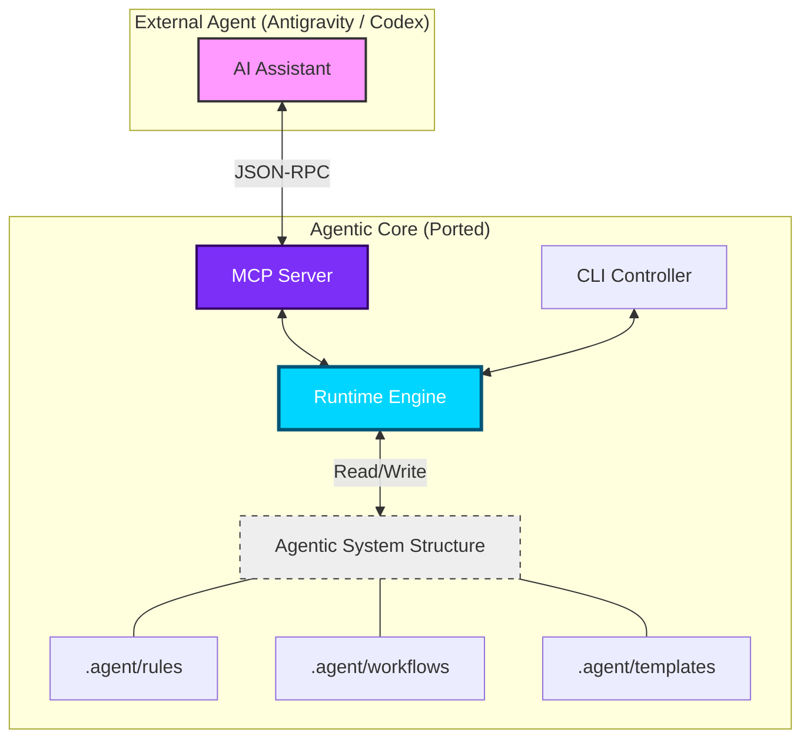
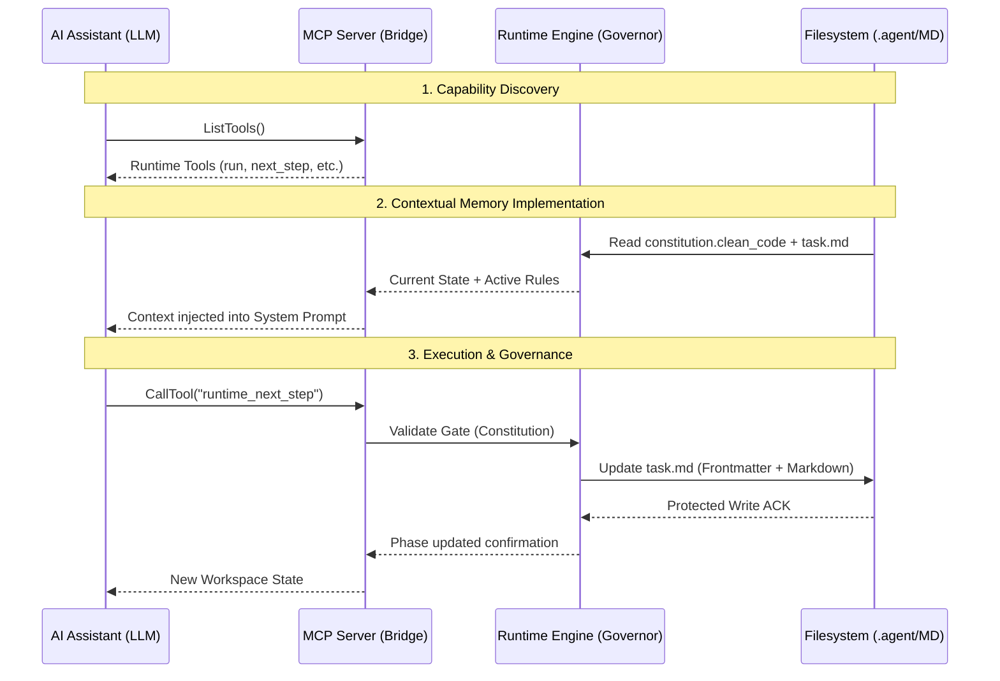
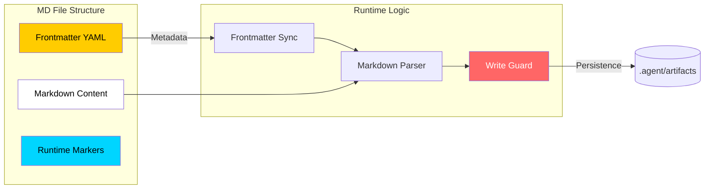
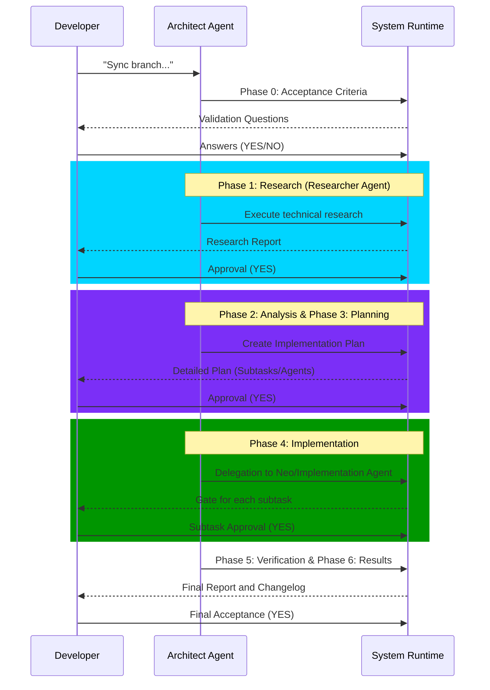
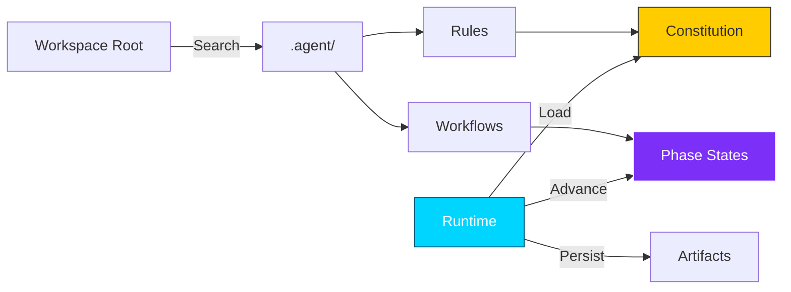

# Agentic System — Architecture & Workflows

## Agent & Tools Structure (Skills)

> [!TIP]
> **Interactive Presentation Available**: I have generated an interactive presentation page with high-quality visuals in `PRESENTATION.html`.

This document contains the technical reference for the system diagrams.

## 1. System Architecture (Core)

The system is designed to be portable and execution-agnostic (IDE or CLI).

---

## 2. Conceptual Flow & Governance

This diagram explains how the agent system "thinks" and "executes" through the interaction between the LLM, the MCP protocol, and the Runtime that governs the filesystem.

---

## 3. Data Structure (Markdown as Single Source of Truth)

The system uses Markdown files with specific metadata to maintain state consistency.

---

## 4. Task Lifecycle (Long Strategy)

The system guarantees traceability through mandatory phases and approval gates.

---

## 5. Runtime vs Workspaces Interaction

The `Runtime` is the engine that coordinates constitution reading and artifact persistence.

## 6. Portability (Agnosticism)

The ported system can now be installed as an NPM dependency:

1.  **CLI**: `npx agentic-workflow`
2.  **MCP**: Configured in the IDE as an STDIO server.
3.  **Core**: Programmatically usable by other automation scripts.
