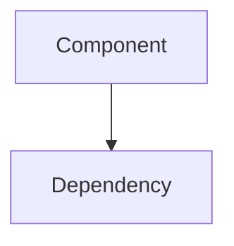

# Coding Layer Report — {{layer}} — {{taskId}}-{{taskTitle}}

## 1. Who (Agent Identity)
- **Agent**: {{agent}}
- **Role**: {{role}} (`roles.{{layer}}`)
- **Constitution**: `constitution.{{layer}}` + `constitution.clean_code`

---

## 2. How (Technical Details)

### Changes Implemented
- **Files created/modified**: (list with paths)
- **APIs/contracts affected**: (interfaces, types, exports)
- **New functions/classes**: (names and purpose)

### Technical Specifications
- (Detailed description of implementation approach)
- (Architecture decisions and patterns used)

### Diagrams
> Include mermaid diagrams when the implementation involves:
> - New communication flows
> - State transitions
> - Component relationships
> - Data flow

---

## 3. Why (Justification)
- **Objective**: (What problem does this solve?)
- **Reasoning**: (Why this approach over alternatives?)
- **Alternatives discarded**: (Brief description and reason)

---

## 4. Results

### Compilation
- `npm run compile`: PASS | FAIL
- Errors resolved: (list if any)

### Self-Validation Checklist
> Copy the checklist from the workflow and mark each item.

### Code Quality
- Clean code compliance: YES | NO
- Constitution compliance: YES | NO

---

## 5. E2E Test Indications

### Required Test Scenarios
- (List scenarios that should be covered by e2e tests)

### Test Setup
- (Prerequisites, fixtures, or mock data needed)

### Assertions
- (Expected behaviors to verify per scenario)

### Integration Points
- (How this layer connects to others — what to test at boundaries)
